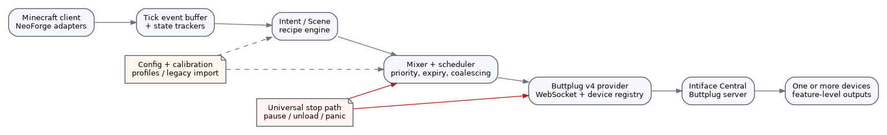
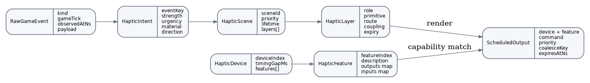
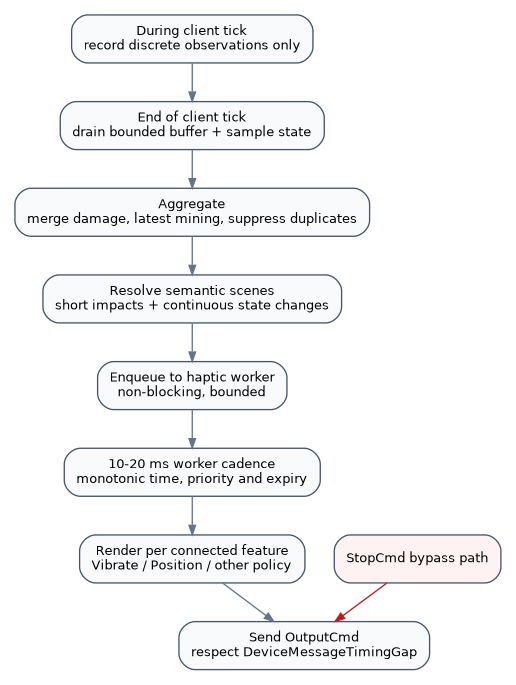

# Document status

**Audience:** senior Java/Minecraft mod developer responsible for architecture, implementation, validation, and release engineering.

**Status:** implementation-ready brief. This document supersedes earlier exploratory designs and generated scaffolds. The earlier code bundles should be treated only as disposable examples; the implementation should be bootstrapped from a fresh current Stonecraft template and rebuilt against the decisions below.

**MVP target:** NeoForge client mod, Minecraft Java Edition 26.2 and 26.1.x (initially tested against 26.1.2), Java 25, Stonecraft, and Buttplug Protocol Specification v4 through an external Intiface server.

**Working name:** “Minegasm Next” is used in this brief to describe the replacement project. Final product name, mod ID, package coordinates, and trademark position must be decided before public release.

# Contents

- Executive summary
- Product definition and scope
- Re-evaluation findings and Minegasm parity
- Supported platform, Stonecraft, and NeoForge build plan
- Architecture and domain model
- Minecraft ticks, buffers, scheduling, and threading
- Client-side event acquisition
- Haptic recipes and pleasantness
- Buttplug v4 integration and output renderers
- Configuration, safety, testing, CI, and implementation plan
- Risks, decisions, source references, and handoff checklist

# Executive summary

The project should be implemented as a clean, client-side replacement for the currently available Minegasm mod while correcting its architectural limitations. Compatibility means covering its user-visible gameplay triggers, modes, connection workflow, and configuration migration. Replacement does **not** mean copying its code.

The core design is:

1. Observe Minecraft gameplay on the client thread.
2. Collect short-lived discrete events and sample continuous player state once per client tick.
3. Convert observations into device-independent `HapticIntent` and `HapticScene` objects.
4. Mix scenes using priority, expiry, interruption, and continuous-state rules.
5. Render each scene independently to every enabled compatible Buttplug device feature.
6. Schedule feature-level `OutputCmd` messages on a dedicated haptic worker using monotonic real time.
7. stop all output immediately on pause, world unload, disconnect, shutdown, safety violation, or panic action.



## Decisions that should not be reopened without an architecture decision record

| Area | Final recommendation |
|---|---|
| Loader | NeoForge only for MVP. Preserve boundaries that permit another loader later, but do not build Fabric support now. |
| Versions | Support the two current release lines: 26.2.x and 26.1.x. Create initial Stonecraft variants for `26.2-neoforge` and `26.1.2-neoforge`. |
| Java | Java 25 toolchain for all 26.x variants. |
| Workspace | Fresh current Stonecraft template, with exact plugin versions pinned after bootstrap. Use Mojang mappings/default deobfuscated names. |
| Runtime location | Entire mod is client-side. It must work on multiplayer servers that do not install the mod. |
| Device protocol | Buttplug v4 only for MVP, connecting to a separately running Intiface server. No embedded device-protocol server. |
| Device abstraction | Buttplug device features and advertised output capabilities, not hard-coded “toy classes.” |
| Event processing | Tick-local event buffer plus continuous state trackers, semantic scene queue, and per-device/feature scheduler. Never a single FIFO queue. |
| Timing | Minecraft ticks for observation and ordering; `System.nanoTime()` for durations, cooldowns, expiry, and scheduling. |
| Output support | `Vibrate` production-ready. `Position` and `HwPositionWithDuration` experimental opt-in after calibration. Other output types discovered and represented but disabled unless explicitly implemented. Never map `Spray`. |
| Minegasm parity | Attack, hurt, block break/mine, block placement, harvest, fishing bite, XP change, advancement, and vitality; Normal, Masochist, Hedonist, Accumulation, and Custom modes. |
| Multiple devices | Every event may target all enabled compatible features, with per-event and per-feature routing. |
| Safety | Localhost by default, explicit enablement, output caps, panic stop, lifecycle stop, calibration for position devices, and no device I/O on the Minecraft thread. |
| Compatibility strategy | Provide a “Minegasm Classic” recipe pack/config importer in addition to a modern balanced recipe pack. |

# 1. Product definition

## 1.1 Product goal

Create a reliable Minecraft haptic feedback mod that translates gameplay into pleasant, varied, configurable output across one or more devices connected through Buttplug. The first release should be credible as a replacement for Minegasm rather than merely a technology demonstration.

The experience should communicate meaningful game information:

- combat impacts should be immediately recognizable;
- mining should provide subtle material texture rather than constant maximum output;
- block completion, XP, and advancements should feel rewarding;
- warnings should be clear without being painful or exhausting;
- multiple devices should complement one another rather than duplicate identical signals blindly;
- user configuration should permit both simple presets and advanced per-event/per-device control.

## 1.2 Primary users

- Existing Minegasm users who need a maintained build for current Minecraft/NeoForge versions.
- Players with one or more Buttplug-compatible vibration, motion, or pressure-capable devices.
- Advanced users who want event-specific routing and calibration.
- Future contributors who need a stable internal model before additional protocols or loaders are added.

## 1.3 MVP release definition

The MVP is complete only when it includes:

- successful connection to a Buttplug v4 server;
- explicit scan controls and live device list updates;
- multiple connected devices and multiple features per device;
- all current Minegasm-compatible gameplay triggers listed in Section 4;
- all current Minegasm-compatible modes, including Accumulation;
- a modern default recipe pack and a Minegasm Classic compatibility recipe pack;
- vibration output across all enabled `Vibrate` features;
- bounded event/scheduler queues with tests;
- robust stop and reconnect behavior;
- a usable in-game configuration screen;
- automated builds for both Minecraft variants;
- no blocking network or device operations on the Minecraft client thread.

Position-device support can be released as “experimental” within the MVP if it meets the calibration and stop requirements. It must not delay the reliable vibration path.

## 1.4 Explicit non-goals for MVP

- Fabric, Forge, Quilt, Bedrock, or server-side components.
- Direct Bluetooth, HID, SDL, OpenXR, or vendor SDK integrations.
- Embedding Intiface or implementing device protocols inside the mod.
- Remote multiplayer synchronization of another player’s events.
- Cloud services, telemetry, accounts, analytics, or remote control.
- Automatic mappings for `Spray` output.
- Electrical stimulation control or any direct voltage/current model.
- Full waveform/audio-rate haptics.
- A public plugin SDK. Internal interfaces should be extensible, but plugin loading can wait.

# 2. Re-evaluation findings and corrections

This section records important corrections to earlier exploratory work.

## 2.1 The version target is now year-based Minecraft 26.x

Minecraft Java Edition 26.2 was released on 16 June 2026. NeoForge 26.1 documentation requires Java 25. The build should therefore target the current 26.2 line and previous 26.1 line, with Java 25 rather than Java 21. The exact NeoForge build numbers must be pinned and validated when implementation begins; do not use unbounded dynamic dependencies in release branches.

Recommended initial variant identifiers:

```text
26.2-neoforge
26.1.2-neoforge
```

The support policy is line-based (`26.2.x`, `26.1.x`), while CI and published binaries are built against explicit tested patch versions.

## 2.2 Bootstrap from current Stonecraft rather than repairing generated scaffolds

Use the current Stonecraft quick-start/template and then pin exact Stonecraft and Stonecutter plugin versions. Current Stonecraft documentation shows the modern 1.9.x generation and Stonecutter 0.8.x family. Earlier generated bundles may have incorrect Gradle structure, API assumptions, event names, or dependency versions and should not become the repository foundation.

## 2.3 Minegasm parity is broader than six intensity fields

The current Minegasm source contains more behavior than the older public configuration page describes. The replacement target must account for:

- attack;
- hurt;
- mine/block break;
- block placement;
- harvest;
- fishing bite;
- XP change;
- advancement earned;
- vitality;
- Normal, Masochist, Hedonist, Accumulation, and Custom modes.

The developer should pin a specific upstream Minegasm commit during kickoff and record a final behavior inventory because the repository can change after this brief.

## 2.4 Client-only multiplayer compatibility changes event acquisition

Server-oriented NeoForge events cannot be assumed to fire in a client mod connected to an unmodified multiplayer server. Event acquisition must use client-observable state and actions as the canonical source. NeoForge client events may be used where reliable, but every compatibility trigger needs a client-side fallback or state tracker.

Examples:

- hurt: health/absorption delta and hurt animation state, not only a server damage event;
- block break: local destroy progress plus observed block-state transition, not only `BreakEvent`;
- XP: client XP/level delta;
- advancement: client advancement/toast update;
- place: successful local use action plus observed world/inventory change.

## 2.5 Buttplug v4 is feature-based and one-command-per-message

The current protocol sends complete `DeviceList` snapshots. Device indexes are valid only while the device remains in the latest snapshot. Each device has feature indexes, and each feature advertises one or more output types and ranges. `OutputCmd` targets exactly one feature. `DeviceMessageTimingGap` is enforced by the server for output dispatch and the server may coalesce same-feature commands. `StopCmd` bypasses the gap.

Consequences:

- do not cache a device index across removal/reconnection;
- do not select only the first vibration device;
- maintain a normalized registry of all device features;
- send feature-level commands;
- treat server timing-gap handling as transport protection, not as a replacement for game-semantic priority and expiry;
- implement stop as a first-class path.

## 2.6 “Intensity” cannot be the universal device model

A scalar works for vibration speed, but not for every output context. The internal scene model must remain semantic and device-independent. A short impact can render as vibration on one feature and a calibrated motion segment on another. Output-specific renderers translate meaning into Buttplug commands.

# 3. Compatibility and replacement baseline

## 3.1 Clean-room implementation rule

The upstream Minegasm repository is distributed under AGPL-3.0. Treat its code and behavior as a compatibility reference. Do not copy source into a differently licensed project without an explicit licensing decision and legal review. Public documentation, observed behavior, configuration names, and independently developed algorithms can guide compatibility; preserve a record of sources reviewed and code provenance.

This brief is not legal advice. The project owner must decide the final license and whether use of the existing name is permitted.

## 3.2 Compatibility event inventory

| Compatibility event | Existing behavior to preserve | Modern interpretation |
|---|---|---|
| Attack | Trigger when local player attacks an entity. Existing state is short-lived and may add a feedback boost. | Fast snap/impact; optional directional hand routing later. |
| Hurt | Trigger from local player damage. | Strong clear impact, merged over a short window; must not arrive late. |
| Mine / block break | Existing implementation triggers on completed block break, with ore distinction. | Separate subtle mining texture state from satisfying block-break completion. Classic pack can retain break-only scalar behavior. |
| Place | Trigger after successful block placement. | Short soft placement knock/pop. |
| Harvest | Existing implementation has a short harvest pulse and interacts with mining state. | Crop/harvest completion reward; exact compatibility semantics must be verified against pinned source. |
| Fishing | Existing source detects a bobber bite/motion condition. | Distinct bite tug/pulse; avoid continuous fishing output. |
| XP change | Strength relates to XP amount and level change; Accumulation adds charge. | Sparkle/pulse pattern scaled by delta, with level-up accent. |
| Advancement | Duration varies by advancement frame/type; early accent. | Reward fanfare pattern, capped so long duration does not become constant maximum output. |
| Vitality | Existing modes use healthy/full state or critical-health state. | Periodic status pulse with mode-dependent condition. |

## 3.3 Compatibility modes

The replacement should expose these presets:

- **Normal:** reward/action-oriented; little or no hurt/vitality output.
- **Masochist:** damage/critical-state oriented; suppress most reward events.
- **Hedonist:** broad event coverage.
- **Accumulation:** gameplay events add to a decaying or consumable intensity/charge state.
- **Custom:** per-event values and routing.

Do not hard-code modes into event classes. A `RecipePack`/`Preset` resolves event parameters, while the event collector and engine stay mode-neutral.

## 3.4 Two recipe packs

### Minegasm Classic

Purpose: replacement compatibility. It should reproduce upstream event enablement, relative intensities, durations, and mode defaults as closely as practical, including an optional scalar “maximum active state” mixer.

### Balanced / Modern

Purpose: preferred default for new users. It should use:

- short envelopes rather than long flat output;
- mining texture plus completion pop;
- priority and ducking;
- per-output rendering;
- fatigue protection;
- subtle variation;
- independent multi-device routing.

Keep the two packs separate so compatibility changes do not constrain the modern engine.

## 3.5 Legacy configuration import

On first run, detect an old Minegasm client config only with user consent or clear UI. Import:

- server URL;
- enabled state;
- selected mode;
- event intensity values;
- known timing/frequency values where meaningful.

The importer should:

1. parse without modifying the original file;
2. show a migration preview;
3. write the new config atomically;
4. mark migration complete;
5. retain the source path in logs but not device-sensitive contents;
6. never silently enable experimental output types.

# 4. Supported platform and build strategy

## 4.1 Version matrix

| Variant | Minecraft | Loader | Java | Status objective |
|---|---:|---|---:|---|
| Current | 26.2.x (initial 26.2) | NeoForge 26.2 build pinned at kickoff | 25 | Primary development and release target. |
| Previous | 26.1.x (initial 26.1.2) | NeoForge 26.1 build pinned at kickoff | 25 | Supported compatibility release. |

If the available NeoForge 26.2 build is still marked beta, release notes must state that clearly and CI must pin the tested build. Do not delay architecture work, but do not imply stability beyond the dependency’s own status.

## 4.2 Stonecraft workspace

Create the repository from a fresh current Stonecraft template and configure only the NeoForge loader for the two variants. Preserve Stonecraft’s generated structure. Do not manually invent a parallel multi-project layout unless the template requires it.

Principles:

- pin Gradle wrapper, Stonecraft, Stonecutter, and loader plugin versions;
- use Java toolchains rather than relying on developer `JAVA_HOME`;
- use Mojang names/default deobfuscated mappings;
- centralize dependency versions in the Stonecraft-supported version/property files;
- use Stonecutter conditionals only at version-boundary adapter points;
- keep core engine packages free of Minecraft/NeoForge types;
- produce one jar per version variant;
- verify mod metadata independently for each variant.

## 4.3 Suggested repository shape

The exact paths should follow the current template, but the logical package organization should resemble:

```text
<root>
  build logic / Stonecraft configuration
  versions/
    26.2-neoforge
    26.1.2-neoforge
  src or shared sources/
    .../api/                 public/internal domain contracts
    .../core/                intents, scenes, recipes, mixer
    .../runtime/             worker, scheduler, lifecycle
    .../buttplug/            protocol DTOs, websocket, registry
    .../minecraft/           common client observations
    .../neoforge/            loader bootstrap and version adapters
    .../config/              config model, migration, validation
    .../ui/                  config screens and diagnostics
    .../testsupport/         fake clock, fake server, fixtures
  docs/
  gradle/
  .github/workflows/ or Forgejo actions equivalent
```

## 4.4 Mod identity decision

During development, use a non-conflicting mod ID such as `minegasm_next` unless the project owner has confirmed an in-place replacement strategy. A jar cannot safely coexist with another mod using the same ID. Before release, choose one of:

- true drop-in replacement using `minegasm` ID and explicit incompatibility with the old mod;
- new ID plus legacy config importer and “replacement-compatible” messaging.

The second option is technically safer until naming and licensing are settled.

# 5. System architecture

## 5.1 Architectural boundaries

### Minecraft observation layer

Owns NeoForge registration and client-side observation. It may reference Minecraft classes. It emits immutable raw observations and state snapshots; it never sends device commands.

### Haptic domain layer

Owns normalized intents, semantic scenes, recipes, routing, priorities, and preset logic. It must have no Minecraft or WebSocket dependencies and should be highly unit-testable.

### Runtime layer

Owns active scenes, continuous states, monotonic scheduling, coalescing, interruption, and lifecycle stop. It must not block the Minecraft thread.

### Buttplug provider layer

Owns WebSocket connection, protocol version negotiation, request IDs, ping, scanning, `DeviceList`, feature registry, `OutputCmd`, `StopCmd`, and error handling.

### UI/config layer

Owns user settings, presets, device enablement, calibration, diagnostics, migration, and panic actions. It must not mutate engine state directly; changes should be applied through a validated configuration snapshot.

## 5.2 Core domain model



Recommended Java records/interfaces:

```java
public record RawGameEvent(
    GameEventKind kind,
    long gameTick,
    long observedAtNs,
    Map<String, Object> payload
) {}

public record HapticIntent(
    String eventKey,
    float strength,       // normalized 0..1
    float urgency,        // normalized 0..1
    MaterialFeel material,
    SpatialDirection direction,
    Set<String> tags,
    long createdAtNs
) {}

public record HapticScene(
    String sceneId,
    int priority,
    List<HapticLayer> layers,
    long createdAtNs,
    long expiresAtNs
) {}

public record HapticLayer(
    String layerId,
    HapticRole role,
    HapticPrimitive primitive,
    HapticRoute route,
    CouplingMode coupling,
    int priority,
    long startOffsetNs,
    long expiresAfterNs,
    String coalesceKey
) {}
```

Primitive examples:

```java
public sealed interface HapticPrimitive {
    record Impulse(float level, Duration duration,
                   Duration attack, Duration release) implements HapticPrimitive {}

    record Texture(float level, Duration duration,
                   float grain, float density,
                   float irregularity) implements HapticPrimitive {}

    record Rumble(float level, Duration duration,
                  float roughness, boolean decay) implements HapticPrimitive {}

    record Sweep(float from, float to,
                 Duration duration, Easing easing) implements HapticPrimitive {}

    record BeatPattern(List<Beat> beats) implements HapticPrimitive {}
}
```

## 5.3 Device model normalized from Buttplug

```java
public record HapticDevice(
    int deviceIndex,
    String deviceName,
    Optional<String> displayName,
    int messageTimingGapMs,
    Map<Integer, HapticFeature> features,
    long registryGeneration
) {}

public record HapticFeature(
    int featureIndex,
    String description,
    Map<OutputKind, OutputCapability> outputs,
    Map<InputKind, InputCapability> inputs
) {}

public record OutputCapability(
    OutputKind kind,
    int minimum,
    int maximum,
    Optional<IntRange> durationMs
) {}
```

`registryGeneration` is internal and increments when a new full `DeviceList` is accepted. Scheduled commands must capture the generation and be discarded if it no longer matches, preventing output to a reused device index.

## 5.4 Routing model

Routes should specify capabilities and policy rather than brand names:

```java
public record HapticRoute(
    Set<OutputKind> allowedOutputs,
    boolean requiresExperimentalOptIn,
    Set<Integer> includedDeviceIndexes,
    Set<FeatureRef> includedFeatures,
    Set<FeatureRef> excludedFeatures,
    DeliveryMode deliveryMode
) {}
```

Delivery modes:

- `ALL_COMPATIBLE`: render to every enabled compatible feature;
- `BEST_PER_DEVICE`: choose the highest scoring feature/renderer per device;
- `BEST_GLOBAL`: choose one endpoint to avoid duplication;
- `SUPPLEMENTAL`: play only if the user enabled that layer/output class;
- `EXCLUSIVE`: suppress weaker layers on the same endpoint.

The default for common impact/reward events should be `ALL_COMPATIBLE` for vibration features and `SUPPLEMENTAL` for experimental motion features.

# 6. Minecraft ticks, buffers, queues, and threading

## 6.1 Fundamental timing rule

Minecraft ticks are observation boundaries, not the haptic clock.

Use:

- `gameTick` to order observations and deduplicate game actions;
- end-of-client-tick to drain and aggregate;
- `System.nanoTime()` for effect duration, cooldown, command expiry, pattern phase timing, and reconnect backoff.

Never calculate a 500 ms effect as “ten ticks.” At reduced tick rate that effect would become too long; during client stalls it may execute late. Real-time haptics must expire rather than replay stale events.



## 6.2 Required data structures

Use four distinct structures, each with a different semantic contract.

### A. Tick-local discrete event buffer

- Written and drained on the client thread.
- `ArrayDeque<RawGameEvent>` is sufficient.
- Maximum recommended size: 128 observations per tick.
- Overflow policy: retain high-priority observations; increment a diagnostic counter; never allocate without bound.
- Cleared at end of tick and on lifecycle stop.

### B. Continuous state tracker set

Not a queue. It contains latest sampled facts:

```java
record ClientStateSnapshot(
    float health,
    float absorption,
    int food,
    int experienceLevel,
    float experienceProgress,
    int totalExperience,
    boolean mining,
    Optional<BlockPos> miningTarget,
    float miningProgress,
    Optional<ResourceLocation> miningBlock,
    boolean onFire,
    boolean underwater,
    Optional<FishingSnapshot> fishing,
    boolean paused,
    boolean worldReady
) {}
```

Track transitions against the previous snapshot. Continuous effects are started, updated, or stopped by state transitions; they are not re-enqueued as new effects every tick.

### C. Cross-thread scene ingress queue

- Bounded multi-producer/single-consumer queue or a synchronized bounded queue.
- Maximum recommended size: 64 scenes.
- Game thread offers without blocking.
- On overflow: drop expired and lowest-priority scenes; preserve stop/control messages.
- The first implementation can use a small custom synchronized ring buffer to avoid another dependency.

### D. Per-feature scheduled output state

Do not use a FIFO. Maintain:

- an interrupt lane for stop/control;
- a small priority queue for short impacts/rewards;
- a `Map<coalesceKey, ScheduledOutput>` for latest-wins continuous/update commands;
- active pattern state per feature;
- last-dispatch time and current held output.

Recommended cap: no more than 4 pending commands per feature and 16 per device. Freshness matters more than completeness.

## 6.3 Client-thread flow

At the end of each client tick:

```java
void onClientTickEnd(Minecraft minecraft) {
    long nowNs = clock.nanoTime();

    List<RawGameEvent> discrete = tickBuffer.drain();
    ClientStateSnapshot current = stateSampler.sample(minecraft, nowNs);
    StateTransitions transitions = stateTracker.update(current);

    List<HapticIntent> intents = aggregator.aggregate(
        discrete, transitions, current, nowNs
    );

    for (HapticIntent intent : intents) {
        recipeResolver.resolve(intent, configSnapshot)
            .ifPresent(sceneQueue::offerNonBlocking);
    }

    if (current.paused() || !current.worldReady()) {
        lifecycleController.requestStop(StopReason.GAME_INACTIVE);
    }
}
```

This method must perform no WebSocket waits, scans, sleeps, blocking futures, file I/O, or device command serialization beyond lightweight immutable object creation.

## 6.4 Haptic worker flow

A single dedicated worker is sufficient for MVP. Cadence: approximately 10-20 ms, using a scheduled executor or condition-based wake-up rather than a busy loop.

```java
void workerCycle() {
    long nowNs = clock.nanoTime();

    drainSceneIngress(nowNs);
    expireStaleScenes(nowNs);
    updateContinuousScenes(nowNs);
    List<RenderedOutput> outputs = renderer.render(activeScenes, deviceRegistry.snapshot(), config);
    List<ScheduledOutput> due = scheduler.acceptAndPoll(outputs, nowNs);

    for (ScheduledOutput output : due) {
        provider.send(output); // asynchronous; returns tracked future
    }
}
```

The worker owns scene/mixer/scheduler mutable state, avoiding fine-grained locks.

## 6.5 WebSocket/provider threading

JDK `java.net.http.WebSocket` is a reasonable default because Java 25 is already required. Use a dedicated executor. Incoming protocol messages should be parsed on provider threads and reduced to immutable registry updates/events passed to the haptic worker.

Never invoke Minecraft APIs from a WebSocket callback. UI connection status should be published through an atomic immutable status snapshot and read on the client thread.

## 6.6 Priority, expiry, and coalescing defaults

| Event/layer | Priority | Typical expiry | Coalescing/interruption |
|---|---:|---:|---|
| Stop/control | 1000 | none | bypass all queues and timing gaps |
| Death / critical safety | 110 | 150 ms | interrupt all gameplay output |
| Explosion shock | 100 | 200 ms | interrupt/duck continuous low priority |
| Hurt | 90 | 250 ms | merge damage within 80-120 ms |
| Shield/fall impact | 80 | 250 ms | latest/strongest wins per short window |
| Advancement | 70 | 500 ms start deadline | may duck XP, not combat |
| Vitality warning | 70 | 500 ms | latest condition wins |
| Block break / harvest | 60 | 250 ms | completion may overlay mining |
| XP | 50 | 350 ms | sum or strongest within 100 ms |
| Mining texture | 40 | 180 ms | latest wins; update no faster than policy |
| Place | 35 | 200 ms | latest wins per block position |
| Fishing bite | 65 | 300 ms | distinct; interrupt ambient only |
| Footstep/ambient future | 10-20 | 100 ms | drop if endpoint busy |

## 6.7 Why server timing gaps are not enough

Buttplug’s `DeviceMessageTimingGap` protects hardware communication and allows server coalescing. It does not know that an explosion should replace a queued mining texture or that a hurt command becomes misleading after 250 ms. The mod must perform semantic scheduling first, then allow the server to enforce its dispatch gap.

The client may conservatively avoid sending more often than the advertised gap, but should not duplicate complex bundling logic. If a stop is required, send `StopCmd` immediately; the protocol specifies that it bypasses the output timing gap.

# 7. Client-side event acquisition

## 7.1 Adapter policy

For each supported Minecraft line, implement a thin `MinecraftObservationAdapter` with the same internal contract. Use NeoForge events where they are emitted on the physical client in multiplayer. Use observation/state transitions as the compatibility fallback.

```java
interface MinecraftObservationAdapter {
    void register(ClientObservationSink sink);
    ClientStateSnapshot sample(Minecraft client, long nowNs);
    void close();
}
```

All version-specific class names and event signatures must be isolated in `neoforge/version` packages or Stonecutter sections. Do not scatter version conditions through recipes or scheduler code.

## 7.2 Attack

Canonical condition: the local client initiates a valid attack against an entity.

Possible observation sources, in priority order:

1. a reliable NeoForge client interaction/attack event;
2. hook around the local game mode/controller attack call;
3. input attack edge combined with an entity hit result and cooldown validation.

Deduplicate by target entity ID plus game tick. Do not trigger repeatedly from held attack input when no attack action occurred.

Intent fields:

- base strength from attack cooldown/weapon category if available;
- `critical` tag from client-observable critical conditions or feedback packet/particles if reliable;
- target category optional;
- direction normally forward.

## 7.3 Hurt

Canonical condition: local player’s effective health decreases.

Compute effective health as health plus absorption, with care for absorption-only changes. Use `hurtTime`/damage animation as confirmation and source timing, not as the sole magnitude.

Merge multiple decreases observed in a short real-time window. Clamp unusual server corrections. Ignore changes during respawn initialization and dimension transfer.

Strength example:

```text
raw = clamp(damage / configurableReferenceDamage, 0, 1)
strength = smoothstep(raw)
```

Do not wait for exact damage source before producing feedback; latency is more important. Direction/source can enrich the scene if available immediately.

## 7.4 Mining and block break

Model two concepts separately:

- `MINING_ACTIVE`: continuous texture while the local player is actively damaging a block;
- `BLOCK_BROKEN`: discrete completion when the targeted non-air block becomes air/replacement and the client action is attributable to the player.

State tracker keys should include dimension and block position. Reset on target change, tool switch, world unload, or lost interaction.

Material classification should use block tags/properties, not a huge hard-coded block list. Suggested broad material classes:

- stone/ore;
- wood;
- soil/clay;
- sand/gravel;
- metal;
- glass/crystal;
- plants/crops;
- wool/soft;
- liquid/other.

Classic pack may only trigger on completed breaks to match old behavior. Balanced pack uses low-level texture updates around 8-10 Hz maximum plus a completion pop.

## 7.5 Block placement

Observe successful local use of a block item and confirm a block-state transition near the targeted placement position. Avoid triggering for failed use, GUI interactions, eating, or use of non-block items.

Deduplicate by position and tick. Strength can be fixed low-medium with material modifiers.

## 7.6 Harvest

“Harvest” is historically ambiguous. During kickoff, write acceptance examples based on the pinned Minegasm source and observed gameplay. Recommended replacement semantics:

- mature crop harvested;
- crop or harvestable block interaction that produces drops/replants;
- optional shearing/berry collection only if compatibility tests show this was expected.

Do not double-play both block-break and harvest completion at full strength. The recipe resolver should choose or combine a single reward scene.

## 7.7 Fishing bite

Track the local player’s active fishing hook. Detect a bite using the most reliable client state available in 26.x; the existing Minegasm heuristic based on downward bobber motion in fluid can be retained as fallback. Apply a refractory period so one bite does not generate multiple pulses.

A bite should be a distinct tug/double pulse. Casting and reeling can be future events but are not required for parity.

## 7.8 XP change and level-up

Compare client total XP, level, and progress. Emit only positive gain by default; optionally expose loss as an advanced event later.

Include:

- amount estimate;
- whether the level increased;
- number of levels gained;
- source unknown tag.

Coalesce XP orbs arriving in the same 100-150 ms window. Level-up adds an accent beat rather than simply multiplying a flat duration.

## 7.9 Advancement

Use a client-side advancement notification/event or observe the client advancement manager. Include frame/type (`TASK`, `GOAL`, `CHALLENGE`) when available. The Classic pack may reproduce long durations, but the Balanced pack should use a short pattern whose complexity increases by type.

## 7.10 Vitality

Vitality is a derived state, not an event callback.

Compatibility conditions:

- normal/hedonist-style: full health and full food;
- masochist-style: critically low but alive;
- custom: configurable predicates.

Use edge-trigger plus configurable repeat interval. Do not output every tick while the condition is true.

## 7.11 Lifecycle signals

The observation adapter must report:

- client pause state;
- world/player presence;
- dimension/world change;
- respawn/death;
- client stopping;
- config screen actions;
- loss of Buttplug connection.

Each can require clearing state and `StopCmd`.

# 8. Haptic recipes and pleasantness

## 8.1 Recipe design principles

- Prefer short shaped gestures over long flat levels.
- Use strong output rarely; default caps should leave headroom.
- Express importance through rhythm, attack, decay, and layering rather than only amplitude.
- Keep continuous effects subtle and update them at a lower rate than Minecraft ticks.
- Use deterministic, bounded variation so patterns remain recognizable.
- Let reward, warning, texture, and impact feel different.
- Ensure every position pattern has an explicit safe endpoint/neutral return policy.

## 8.2 Recommended primitive vocabulary

| Primitive | Semantic use | Typical events |
|---|---|---|
| `Impulse` | immediate contact/impact | hurt, attack, place, block break |
| `Texture` | repeated material/contact detail | active mining |
| `Rumble` | environmental low-frequency energy | explosion aftershock, large movement future |
| `Sweep` | tension or buildup | future bow draw, charge |
| `BeatPattern` | recognizable notification/reward | XP, advancement, fishing bite, vitality |
| `Hold` | sustained state with fade | carefully limited ambient/state effects |

## 8.3 Event recipe examples

### Hurt, Balanced pack

```yaml
scene: player_hurt
priority: 90
layers:
  - id: impact
    primitive: impulse
    level: "0.28 + 0.52 * smoothstep(strength)"
    durationMs: "85 + 100 * strength"
    attackMs: 8
    releaseMs: 55
    outputs: [Vibrate, HwPositionWithDuration]
    delivery: all-compatible
    expiresAfterMs: 250
  - id: optional_warning
    primitive: beatPattern
    enabledByDefault: false
    outputs: [Constrict]
    experimental: true
```

### Mining, Balanced pack

```yaml
scene: mining_texture
priority: 40
continuousKey: "mining:{dimension}:{blockPos}"
updateIntervalMs: 120
layers:
  - id: texture
    primitive: texture
    level: "0.10 + 0.22 * hardnessNormalized"
    grain: "material.grain"
    density: "material.density"
    irregularity: 0.10
    outputs: [Vibrate, Position, HwPositionWithDuration]
    expiresAfterMs: 180
```

### Block break

```yaml
scene: block_break
priority: 60
layers:
  - id: completion_pop
    primitive: impulse
    level: "0.22 + 0.30 * hardnessNormalized"
    durationMs: 70
    outputs: [Vibrate, HwPositionWithDuration]
    mayOverlay: mining_texture
```

### Fishing bite

Two short beats, the second slightly stronger, with a 70-100 ms gap. This should pre-empt ambient output but not combat.

### XP

Use one to three light beats based on coalesced XP magnitude. A level-up adds a final accent. Cap total scene duration around 350-500 ms in Balanced mode.

### Advancement

- Task: three ascending light beats.
- Goal: ascending beats plus a broader final pulse.
- Challenge: stronger accent and short after-rumble, still under approximately 1.2 seconds for the main pattern.

## 8.4 Variation

Variation should be seeded by stable event context:

```text
seed = hash(eventKey, gameTickBucket, blockStateId, targetId)
```

Recommended bounds:

- amplitude: +/- 5-8%;
- beat spacing: +/- 8-12%;
- duration: +/- 10%;
- never vary safety caps, priorities, or stop timing.

A user-facing “variation” slider can scale these ranges from 0 to the configured maximum.

# 9. Buttplug v4 provider

## 9.1 Connection topology

```text
Minecraft mod -> WebSocket -> Intiface Central/server -> device protocols -> devices
```

Intiface owns Bluetooth/device discovery and hardware protocol support. The mod is a Buttplug client only.

Default server setting:

```text
ws://127.0.0.1:12345
```

Do not assume the port or scheme permanently. Make the URL configurable. Warn and require explicit confirmation for non-loopback hosts or unencrypted remote WebSocket URLs.

## 9.2 Library decision spike

Before implementation, spend a bounded spike evaluating current Java Buttplug clients for:

- full spec v4 support;
- Java 25 compatibility;
- asynchronous/non-blocking API;
- complete `DeviceList` feature/range exposure;
- feature-level `OutputCmd`;
- `StopCmd` selections;
- ping and reconnection handling;
- license suitability;
- active maintenance.

Regardless of outcome, place the chosen library behind `ButtplugTransport` and do not expose library classes to the engine. If no suitable client exists, implement the minimal v4 subset with JDK WebSocket and a shaded JSON library.

## 9.3 Protocol lifecycle

1. Open WebSocket.
2. Send `RequestServerInfo` with protocol major 4 and supported minor.
3. Validate `ServerInfo`, store negotiated version and `MaxPingTime`.
4. Start ping scheduler when required, leaving safety margin.
5. Send `RequestDeviceList`.
6. Optionally send `StartScanning` from explicit user action or configured auto-scan.
7. Replace local registry on every full `DeviceList`; diff for UI and cleanup.
8. Send feature-level `OutputCmd` only for advertised capabilities/ranges.
9. On graceful disconnect: stop, send protocol `Disconnect`, close transport.
10. On unexpected disconnect: clear registry, clear scheduler, surface status, and optionally reconnect using bounded exponential backoff.

## 9.4 Request correlation

Buttplug messages are arrays. Every client request has an unsigned ID and receives `Ok`, `Error`, or the documented response with the same ID. Maintain:

```java
AtomicLong nextRequestId;
ConcurrentHashMap<Long, PendingRequest<?>> pending;
```

Each request has a timeout. Late responses after timeout are logged at debug level and ignored. Never wait synchronously on the Minecraft thread.

## 9.5 DeviceList processing

On every `DeviceList`:

1. parse the complete map;
2. validate that map keys and internal indexes agree;
3. normalize ranges and output types;
4. increment registry generation;
5. atomically replace the registry snapshot;
6. cancel queued/active commands whose device or feature disappeared;
7. clear input subscriptions for removed generations;
8. send a stop for remaining endpoints if the replacement occurred during uncertain state;
9. notify UI/engine through an immutable update.

A reused `DeviceIndex` is a new logical device unless it remained continuously present.

## 9.6 Output type policy

| Buttplug output | Internal support | MVP policy |
|---|---|---|
| `Vibrate` | vibration renderer | Production-ready and enabled after global/device enablement. |
| `Position` | position target renderer | Experimental; requires calibration and explicit opt-in. Prefer duration-aware output when available. |
| `HwPositionWithDuration` | segmented motion renderer | Experimental; preferred for linear motion if advertised. |
| `Oscillate` | speed renderer | Represent, but disabled by default. Add only after hardware testing because a speed value is not equivalent to vibration intensity. |
| `Rotate` | directional speed renderer | Represent, disabled by default; never automatically mirror a vibration signal. |
| `Constrict` | pressure renderer | Out of normal MVP gameplay; experimental opt-in only after a separate safety design. |
| `Temperature` | thermal renderer | Out of MVP; discover/display only. |
| `Led` | status/debug renderer | Optional diagnostic only, not gameplay by default. |
| `Spray` | none | Explicitly unsupported and never routed. |
| Unknown future type | opaque capability | Ignore safely, log once, show as unsupported. |

## 9.7 Range conversion

Internal values remain normalized. Convert only at the renderer edge:

```java
int scaleNormalized(float normalized, IntRange range) {
    float value = Math.clamp(normalized, 0.0f, 1.0f);
    return Math.round(range.min() + value * (range.max() - range.min()));
}
```

For signed directional ranges, normalization requires an output-specific representation; do not feed a generic 0..1 intensity into a signed rotate range without a direction decision.

Apply in order:

```text
recipe level
* global multiplier
* event multiplier
* device multiplier
* feature multiplier
-> response curve
-> calibrated min/max window
-> safety cap
-> advertised integer range
```

## 9.8 Vibration renderer

A vibration feature is level-held until changed. Therefore every short gesture requires a planned stop (`Vibrate Value=0`) unless superseded by another held level. The scheduler should model endpoint state, not enqueue naive start/stop pairs that can become reordered.

Endpoint state machine:

```text
IDLE -> ACTIVE(level, endsAt)
ACTIVE -> ACTIVE(newLevel, newEndsAt) on higher/equal priority replacement
ACTIVE -> DUCKED for an exclusive higher-priority scene
ACTIVE -> IDLE by zero command at end
ANY -> STOPPING -> IDLE on StopCmd
```

For complex beat patterns, the worker advances phases using monotonic deadlines.

## 9.9 Position and HwPositionWithDuration renderer

Position output is not “vibration at another intensity.” Require per-feature calibration:

- safe minimum position;
- safe maximum position;
- neutral/home position;
- maximum fraction of calibrated travel used by gameplay;
- minimum movement duration;
- maximum movement speed policy derived from distance/duration;
- whether return to neutral is required;
- invert direction option;
- test/stop controls.

Recommended defaults:

- gameplay travel cap: 20% of calibrated span;
- normal impact: 4-12% travel;
- strong/rare impact: 12-20%;
- no full-range movement from normal gameplay;
- send a neutral return for impulse patterns;
- stop/cancel queued segments on pause/disconnect;
- prefer hardware duration commands and avoid tick-rate position streaming.

A motion pattern should compile to a small number of segments:

```java
record PositionSegment(float normalizedPosition, Duration duration) {}
```

Example impact:

```text
neutral -> neutral + amplitude (35% of duration)
       -> neutral - smallRebound (20%)
       -> neutral (45%)
```

Clamp every segment to calibrated bounds and the feature’s advertised duration range.

## 9.10 StopCmd

Expose internal commands:

```java
sealed interface StopSelection {
    record All() implements StopSelection {}
    record Device(int deviceIndex) implements StopSelection {}
    record Feature(int deviceIndex, int featureIndex) implements StopSelection {}
}
```

`StopAll` must be invoked on:

- pause when `stopOnPause` is enabled;
- world unload or player removal;
- server disconnect/dimension transition if state is uncertain;
- client shutdown;
- mod disable/config reset;
- panic key/button;
- Buttplug transport error;
- registry invalidation;
- renderer/scheduler invariant failure;
- position calibration cancellation.

Clear local active state before or atomically with sending stop so a delayed worker cycle cannot reassert output.

# 10. Mixer and scheduler design

## 10.1 Scene mixer responsibilities

The mixer decides what should conceptually be active. It should not know JSON or Buttplug ranges.

Responsibilities:

- add/replace active scenes;
- maintain continuous scene keys;
- merge compatible repeated events;
- apply interrupt/duck rules;
- enforce per-role fatigue budgets;
- produce active layers at a requested monotonic time;
- expire stale scenes.

## 10.2 Suggested conflict rules

- explosion shock suppresses mining, place, XP, and ambient during the shock window;
- hurt suppresses footsteps/ambient and ducks mining;
- block-break completion may overlay mining texture, then mining ends;
- advancement may suppress XP reward beats from the same action;
- fishing bite suppresses fishing ambient/future cast state only;
- vitality warning should not stack repeatedly; it uses a repeat interval;
- Stop clears everything.

Represent these in recipe metadata or a small policy table rather than event-name `if` chains in the scheduler.

## 10.3 Damage merging

Within a configurable 100 ms window:

```text
merged = max(a, b) + 0.35 * min(a, b)
merged = clamp(merged, 0, 1)
```

Extend duration slightly but do not queue separate stale hits. Preserve the highest priority and latest expiry.

## 10.4 Continuous latest-wins

Mining texture updates use the same coalesce key. An unsent update replaces the previous update. If an endpoint is already active, the renderer can change level only when the delta exceeds a deadband, for example 0.03 normalized, or when a keepalive deadline requires it.

## 10.5 Feature scheduling

Each feature scheduler stores:

```java
record FeatureScheduleState(
    FeatureRef feature,
    long registryGeneration,
    long lastDispatchedAtNs,
    Optional<ActiveCommand> active,
    PriorityQueue<ScheduledCommand> impacts,
    Map<String, ScheduledCommand> coalesced,
    Optional<PatternCursor> pattern
) {}
```

Selection order:

1. stop/control;
2. due exclusive high-priority command;
3. due pattern transition;
4. highest-priority unexpired impact;
5. latest due coalesced update;
6. required endpoint zero/neutral transition.

Before dispatch, verify:

- current registry generation;
- device and feature still exist;
- output capability still advertised;
- user/device/feature remains enabled;
- command not expired;
- timing gap/deadline policy;
- range and safety clamps.

## 10.6 Fatigue protection

Maintain rolling budgets by role/output:

- high-output vibration time over the last 30 seconds;
- continuous texture time;
- number of strong impacts;
- total motion distance for position features.

When budget is exceeded, gradually reduce low-priority/continuous output before reducing important warning clarity. Expose fatigue protection as enabled by default; permit advanced adjustment but retain hard safety caps.

# 11. Configuration and user experience

## 11.1 Configuration layers

Apply settings in this order:

1. hard safety constraints;
2. provider capability/range;
3. per-feature calibration;
4. device enablement and cap;
5. recipe pack/mode;
6. event enablement and multiplier;
7. global intensity and variation;
8. runtime fatigue adjustment.

## 11.2 Required screens

### Connection

- server URL;
- connection state and negotiated protocol version;
- connect/disconnect;
- start/stop scan;
- auto-connect and auto-scan options;
- clear error messages;
- warning for non-loopback URLs.

### Devices

- all devices from current `DeviceList`;
- display/device name and current index (index only in diagnostics);
- all features and advertised outputs;
- enable/disable per device and feature;
- output support status;
- device intensity cap;
- test light/medium pattern;
- stop device / stop all.

### Gameplay

- recipe pack;
- compatibility mode;
- global intensity;
- variation;
- fatigue protection;
- event toggles/multipliers;
- output type routing;
- reset to preset.

### Position calibration

A separate guarded workflow:

1. explain that movement output is experimental;
2. require explicit enablement;
3. stop all before beginning;
4. let user move/test in small increments;
5. set min, max, neutral, inversion, and gameplay travel cap;
6. validate bounds;
7. save atomically;
8. test a small impulse;
9. prominent stop control always visible.

## 11.3 Config persistence

Use a versioned config schema and immutable runtime snapshot. NeoForge config utilities may be used for simple scalar settings, but nested device/feature calibration may be easier in a dedicated JSON/TOML file.

Requirements:

- schema version;
- atomic write via temporary file and rename;
- corrupt-file backup and safe defaults;
- unknown fields preserved where practical;
- migrations tested;
- no device output enabled merely because a new capability appears;
- no secrets should be required.

A complete example is in `examples/config.example.yaml`.

## 11.4 Preset semantics

Presets must be data, not enum switch statements scattered across code. A preset defines:

- enabled events;
- event multipliers;
- recipe pack;
- output routing defaults;
- fatigue defaults;
- optional vitality predicate;
- accumulation parameters.

## 11.5 Accumulation mode

Implement accumulation as a reusable state processor:

```text
charge(t) = max(0, previousCharge - decayPerSecond * deltaTime)
charge += eventContribution
outputLevel = curve(clamp(charge / capacity, 0, 1))
```

Clarify the compatibility behavior by testing upstream. Make capacity, decay, contributions, and discharge/hold semantics configurable internally. Use real time, not tick counts. Avoid an unbounded accumulator.

# 12. Safety, privacy, and security

## 12.1 Safety posture

The project controls physical hardware. A software bug must fail toward stopped output.

Mandatory controls:

- master enable defaults off until setup completes;
- global intensity cap;
- per-device and per-feature caps;
- panic key binding that works while in a world/menu where possible;
- `StopAll` on lifecycle transitions;
- bounded queues and expiry;
- no replay of stale commands after reconnect;
- calibration for position output;
- experimental gating for non-vibration outputs;
- watchdog that stops output if worker/provider heartbeat stalls;
- test patterns start low;
- clear UI status when output is active.

## 12.2 Network safety

- default to loopback URL;
- do not automatically connect to arbitrary LAN/Internet endpoints imported from old configs without confirmation;
- warn on `ws://` non-loopback;
- support `wss://` if the transport/server supports it;
- cap incoming message size and nesting;
- reject malformed ranges/indexes;
- do not execute unknown output types;
- no inbound listening server in the mod.

## 12.3 Privacy

- no telemetry;
- no device names in crash reports by default; hash or redact them;
- logs should redact server URL credentials/query parameters;
- configuration may contain intimate device information; do not upload it automatically;
- diagnostic export should have a “redact device identity” option;
- do not expose device state to multiplayer servers.

## 12.4 Watchdog

The worker should update an `AtomicLong lastHealthyCycleNs`. A separate lightweight watchdog checks:

- worker cycle delay beyond threshold;
- pending request timeout storm;
- provider state mismatch;
- repeated serialization errors.

On invariant failure, atomically disable output, clear schedules, and request `StopAll` best-effort.

# 13. Error handling and reconnection

## 13.1 Connection state machine

```text
DISCONNECTED
  -> CONNECTING
  -> NEGOTIATING
  -> CONNECTED_NO_DEVICES
  -> SCANNING / READY
  -> DEGRADED
  -> STOPPING
  -> DISCONNECTED
```

Every transition should be observable in UI and logs. Invalid transitions are bugs and should trigger a safe stop.

## 13.2 Reconnect behavior

Optional auto-reconnect:

- exponential backoff, e.g. 1, 2, 4, 8, 15, 30 seconds;
- jitter;
- stop after a configurable ceiling or continue quietly;
- never replay old scenes after reconnect;
- request a fresh device list;
- devices/features start disabled according to saved identity matching and user policy, not stale indexes;
- require recalibration if the physical identity cannot be matched confidently.

## 13.3 Identity matching

Buttplug indexes are ephemeral. For saved preferences, create a best-effort identity key from stable information available to the client, such as device name/display name plus feature signature. Treat matching as probabilistic and expose it to users. Do not assume two identical devices can always be distinguished unless Intiface provides distinct display names.

# 14. Testing strategy

## 14.1 Test pyramid

### Pure unit tests

Highest priority. No Minecraft runtime or real WebSocket.

- normalization curves;
- event aggregation;
- damage merge;
- recipe resolution;
- mode/preset values;
- accumulation decay;
- scene conflict rules;
- expiry and priority selection;
- range scaling, including signed ranges;
- position segment clamping;
- registry generation invalidation;
- config migration;
- fatigue budgets;
- deterministic variation.

Use a `FakeClock` everywhere. No test should sleep for timing behavior.

### Protocol tests with fake Buttplug server

Build a local in-process WebSocket fixture or recorded transport abstraction that can:

- negotiate v4;
- require ping;
- return complete `DeviceList` snapshots;
- add/remove/reuse device indexes;
- advertise multiple features/output types;
- return `Ok`/`Error` out of order;
- delay responses;
- disconnect during a command;
- verify `StopCmd`;
- report a timing gap;
- send malformed messages.

Assert exact feature-level commands and no output after stop/generation change.

### Minecraft adapter tests

Where NeoForge GameTest or client test facilities permit:

- health delta produces one hurt intent;
- respawn delta does not produce false hurt;
- mining target change ends old continuous key;
- block-state transition produces block break once;
- XP orb burst coalesces;
- placement failure does not trigger;
- pause/world unload stops;
- multiplayer-like client observation paths do not require server mod events.

Version-specific smoke tests must run for both variants.

### Manual hardware tests

Minimum release matrix:

- one single-feature vibration device;
- one multi-feature vibration device;
- two simultaneous devices;
- one device with nonzero timing gap;
- one position/HwPositionWithDuration device if experimental support ships;
- disconnect/reconnect during active output;
- Intiface server stop/restart;
- low battery/weak link if accessible;
- panic stop under heavy event load.

Record device names privately; publish generic results unless consented.

## 14.2 Performance acceptance

On a typical supported client:

- end-tick observation/aggregation p95 below 0.25 ms with no device I/O;
- no unbounded allocations per tick;
- scene ingress bounded;
- worker idle CPU negligible;
- command latency from client observation to WebSocket send p95 below 75 ms for immediate events under normal load;
- no command older than its expiry sent;
- zero output after completed stop acknowledgement/local stop transition;
- no log spam at normal level.

## 14.3 Chaos tests

Automate randomized sequences of:

- events at high rates;
- device list replacement;
- connection loss;
- timing gaps;
- request errors;
- pause/resume;
- config swaps;
- clock advances.

Invariants:

- queue bounds hold;
- stop always wins;
- registry generation prevents stale targeting;
- all output values remain in advertised/calibrated ranges;
- no worker crash escapes silently.

# 15. CI, packaging, and release

## 15.1 CI matrix

Run on each pull request:

- Java 25 setup;
- Gradle wrapper validation;
- formatting/static analysis;
- pure unit tests once and variant-specific tests as required;
- build `26.2-neoforge`;
- build `26.1.2-neoforge`;
- inspect mod metadata/jar contents;
- protocol fixture integration tests;
- dependency/license report;
- reproducibility check where practical.

Nightly or release:

- full GameTest/client smoke suite;
- dependency update check;
- vulnerability scan;
- release artifact checksums;
- generated changelog/release notes.

## 15.2 Artifact naming

Suggested:

```text
<mod-name>-<mod-version>+mc26.2-neoforge.jar
<mod-name>-<mod-version>+mc26.1.2-neoforge.jar
```

Do not publish one “universal” jar unless Stonecraft/loader behavior proves it reliable. Separate explicit artifacts reduce support ambiguity.

## 15.3 Versioning

Use semantic project versions independent of Minecraft, with Minecraft/loader in artifact metadata. For example:

```text
0.1.0-alpha.1
0.2.0-beta.1
1.0.0
```

A breaking config/protocol change increments project major after 1.0. Minecraft compatibility updates do not automatically imply project major changes.

## 15.4 Release gates

Before first public beta:

- all compatibility events implemented;
- Classic and Balanced packs tested;
- no known output-stuck bug;
- StopAll verified on every lifecycle path;
- two-version CI green;
- config migration tested from representative old files;
- connection/setup documentation complete;
- license/name decision documented;
- experimental outputs clearly labeled;
- privacy-sensitive diagnostics redacted.

# 16. Implementation work plan

The senior developer may split work differently, but dependencies should follow this sequence.

## Epic 0: repository and technical spikes

Deliverables:

- fresh Stonecraft workspace;
- pinned toolchain/dependencies;
- both variants compile a minimal client mod;
- Buttplug Java library evaluation ADR;
- upstream Minegasm pinned commit and parity inventory;
- final mod ID/license decision proposal.

Exit criteria: clean CI builds both variants; architecture boundaries exist as empty packages/modules.

## Epic 1: pure haptic domain and runtime

Deliverables:

- domain records/enums;
- recipe pack model;
- scene mixer;
- fake clock;
- bounded scene ingress;
- per-feature scheduler;
- stop/control path;
- extensive unit tests.

No Minecraft or real Buttplug dependencies.

## Epic 2: Buttplug v4 provider

Deliverables:

- WebSocket transport abstraction;
- v4 handshake/ping;
- scan/list lifecycle;
- full DeviceList registry;
- `OutputCmd` for Vibrate;
- `StopCmd`;
- fake server integration tests;
- connection status snapshot.

Exit criteria: a standalone test harness can connect to Intiface and run safe test vibration on every enabled vibration feature.

## Epic 3: NeoForge observation adapters

Implement attack, hurt, mining/block break, placement, XP, advancement, fishing, harvest, vitality, and lifecycle signals. Start with 26.2, then isolate and resolve 26.1 differences using Stonecutter/version adapters.

Exit criteria: intents are visible in a debug overlay/log without devices and work on an unmodified multiplayer server.

## Epic 4: Minegasm compatibility

Deliverables:

- modes and exact preset data;
- Classic recipes/durations;
- legacy config importer;
- compatibility acceptance matrix;
- no duplicate events.

## Epic 5: modern recipes and multi-device routing

Deliverables:

- Balanced recipes;
- material classifier;
- all-compatible vibration routing;
- device/feature caps;
- deterministic variation;
- fatigue protection;
- multi-device tests.

## Epic 6: UI and diagnostics

Deliverables:

- connection/scanning screen;
- device/features screen;
- presets/events screen;
- test/stop controls;
- logs/diagnostic export;
- accessibility/localization-ready strings.

## Epic 7: experimental position support

Only after vibration is stable:

- calibration workflow;
- `Position`/`HwPositionWithDuration` renderers;
- segment scheduler;
- neutral/stop behavior;
- hardware test evidence;
- default disabled.

## Epic 8: hardening and release

- chaos tests;
- performance profiling;
- two-version manual smoke tests;
- migration docs;
- release packaging;
- security/privacy review;
- beta feedback fixes.

# 17. Definition of done

A feature is done when:

- behavior is defined in a recipe or adapter contract;
- both Minecraft variants compile;
- unit tests cover normal, duplicate, stale, pause, and disconnect paths;
- no network/device call occurs on the client thread;
- output is bounded and expires;
- StopAll interrupts it;
- configuration and UI strings exist;
- logs are actionable and privacy-aware;
- documentation is updated;
- compatibility impact is recorded.

The project MVP is done when all release gates in Section 15.4 pass.

# 18. Key risks and mitigation

| Risk | Impact | Mitigation |
|---|---|---|
| NeoForge client event behavior differs in multiplayer | Missing/duplicate compatibility events | State-observation canonical path; event hooks only as accelerators; multiplayer acceptance tests. |
| Buttplug Java client lacks v4 support | Integration delay | Bounded spike; transport interface; minimal raw v4 implementation fallback. |
| Device indexes reused | Commands target wrong device | Full snapshot replacement, registry generations, clear queues on removal. |
| Long/stale haptics during lag | Unpleasant or misleading output | Monotonic time, expiry, latest-wins continuous state, no tick-duration assumptions. |
| Output remains active after pause/disconnect | Safety/trust failure | universal stop path, watchdog, lifecycle coverage, integration tests. |
| Treating all outputs as scalar | Unsafe/poor behavior | output-specific renderers and opt-in policies. |
| Position hardware varies widely | Unpredictable movement | calibration, low travel defaults, duration bounds, experimental flag. |
| “Replacement” drifts from upstream behavior | Migration dissatisfaction | pinned parity matrix, Classic pack, import tests. |
| AGPL/name uncertainty | Release/legal risk | clean-room provenance, license/name ADR before public beta. |
| Stonecraft/26.2 toolchain moves quickly | Build instability | exact pins, dependency update branch, two-version CI. |
| Too much scope in first release | Delayed usable MVP | vibration path first; experimental output separate; provider-only Buttplug. |

# 19. Open questions requiring owner decision

1. Final product name and mod ID: true in-place replacement or new brand with compatibility importer?
2. Final source license.
3. Whether Minegasm Classic or Balanced is the initial default for migrated users and new users.
4. Exact semantics of “harvest” after pinned upstream behavior review.
5. Whether position support is included in the first public beta or a following beta.
6. Whether auto-connect/auto-scan are enabled by default after first setup.
7. Whether non-loopback Buttplug URLs are supported in MVP or blocked entirely.
8. Whether device preference matching may use/display Intiface display names.
9. How long the previous Minecraft line remains supported after a new major drop.
10. Distribution channels: Modrinth/CurseForge/Codeberg releases/own site and corresponding metadata automation.

# 20. Architecture decision records to create

The repository should include ADRs for:

- ADR-001: clean-room replacement and license strategy;
- ADR-002: Stonecraft + NeoForge-only MVP;
- ADR-003: client-observation event model for multiplayer compatibility;
- ADR-004: semantic scenes rather than direct event-to-command mapping;
- ADR-005: dedicated monotonic haptic worker and bounded queues;
- ADR-006: Buttplug v4 external-server provider;
- ADR-007: full DeviceList registry generations;
- ADR-008: vibration production support and position experimental support;
- ADR-009: Minegasm Classic recipe pack and legacy config migration;
- ADR-010: local-only/no-telemetry privacy posture.

# 21. Source references and verification notes

Facts that can change must be rechecked at implementation kickoff. Sources accessed 16 July 2026:

1. Minecraft Java Edition 26.2 release notes: https://www.minecraft.net/en-us/article/minecraft-java-edition-26-2
2. NeoForge Getting Started (26.1, Java 25): https://docs.neoforged.net/docs/gettingstarted/
3. NeoForge 26.1 migration primer: https://docs.neoforged.net/primer/docs/26.1/
4. Stonecraft website and documentation: https://stonecraft.meza.gg and https://stonecraft.meza.gg/docs
5. Stonecraft repository/template: https://github.com/meza/Stonecraft
6. Buttplug Protocol Specification v4: https://buttplug.io/docs/spec/
7. Buttplug connection messages: https://buttplug.io/docs/spec/identification/
8. Buttplug device discovery: https://buttplug.io/docs/spec/device_discovery/
9. Buttplug device information and timing gap: https://buttplug.io/docs/spec/device_information/
10. Buttplug output commands/types: https://buttplug.io/docs/spec/output/
11. Buttplug stop messages: https://buttplug.io/docs/spec/stop/
12. Minegasm source repository: https://github.com/Sour-o7/minegasm/
13. Minegasm configuration documentation: https://www.minegasm.net/config.html
14. Minegasm setup documentation: https://www.minegasm.net/setup.html

# 22. Handoff checklist

The implementing senior developer should begin by completing the following, in order:

- [ ] Pin the upstream Minegasm commit and finalize the parity spreadsheet.
- [ ] Create ADR-001 for licensing/name strategy.
- [ ] Generate a fresh Stonecraft project and build both NeoForge variants with Java 25.
- [ ] Pin exact Gradle/plugin/NeoForge versions.
- [ ] Run and document the Buttplug Java client spike.
- [ ] Implement the pure domain/scheduler with fake-clock tests before Minecraft hooks.
- [ ] Implement v4 handshake, DeviceList generation tracking, Vibrate, and StopCmd against a fake server.
- [ ] Add real Intiface safe test controls.
- [ ] Implement client-observable events, first on 26.2, then 26.1.2.
- [ ] Add Classic parity presets/importer.
- [ ] Add Balanced recipes and multi-device routing.
- [ ] Build UI, diagnostics, and panic stop.
- [ ] Decide whether position support meets beta criteria.
- [ ] Execute manual hardware and multiplayer test matrices.
- [ ] Complete release/license/privacy documentation.

The appendices in this ZIP provide a parity matrix, recipe catalog, protocol notes, build plan, test matrix, example configuration, and illustrative protocol messages.
